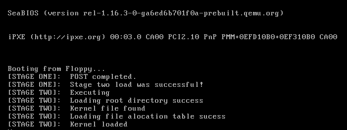

# x86Bootloader


Just a simple first & second stage bootloader for the x86 architecture. Uses the [cdecl](https://en.wikipedia.org/wiki/X86_calling_conventions) calling convention


<div align="center">

</div>

## Build

```shell
make
```

## Run in QEMU

```shell
qemu-system-i386 -boot a -m 256 -drive file=build/SmolOS-0.0.0.img,if=floppy,format=raw
```

## Debug
Start qemu in debug mode

```shell
qemu-system-i386 -boot a -m 256 -drive file=build/SmolOS-0.0.0.img,if=floppy,format=raw -s -S
```

Start gdb and stop at 0x7C00 where the first stage bootloader is located in RAM
```shell
gdb -x .gdbinit
```

## Disk

3½ inch hard disk of 1,440KB
